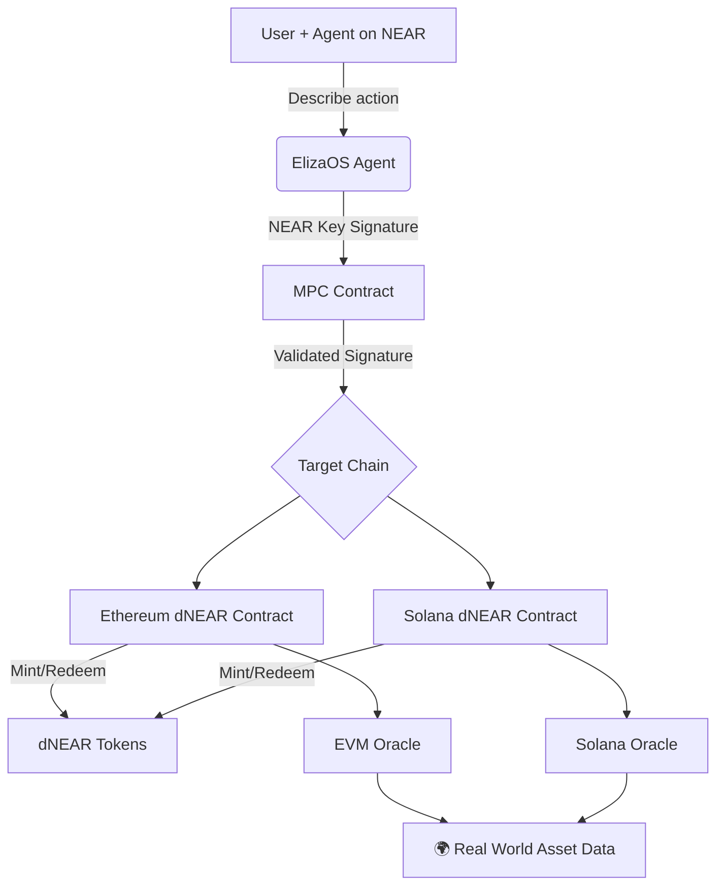

# 🌐 NEAR.AI — Borderless Tokenization Powered by AI Agents

> Break asset barriers. Simplify cross-chain access. Let AI handle Web3.

---

## 🧩 The Problem

Web3 promises decentralization, but today's experience is fragmented and difficult:

- **🌍 Border Barriers of Assets**  
  Global users face restrictions in accessing real-world assets due to geographical and regulatory boundaries.

- **🔐 Fragmented Key Management**  
  Managing private keys across multiple chains is confusing, insecure, and a major hurdle for onboarding Web2 users.

- **🧠 Complex UX of Web3 dApps**  
  Users are forced to juggle between wallets, chains, and keys. What if they could simply “ask” in natural language?

---

## ✅ Our Solution

**NEAR.AI** brings together AI Agents, Tokenization, and Cross-Chain Signatures into a seamless Web3 interface:

### 💰 Tokenization of Assets
Real-world assets like stocks are digitized into tokens (e.g., tokenized Apple stock).

### 🔗 NEAR Cross-Chain Signatures
Use your **NEAR wallet** to interact with **Ethereum**, **Solana**, and beyond. One key, many chains — no need to manage multiple wallets.

### 🤖 AI Agents for Web3
Powered by **ElizaOS**, users describe actions in natural language (e.g., _“Mint 1 Apple stock token on Ethereum”_), and the AI agent executes it behind the scenes.

---

## 🛠️ Tech Stack

| Layer         | Tech Used               | Description                                                                 |
|--------------|--------------------------|-----------------------------------------------------------------------------|
| 🤖 AI Agent   | [ElizaOS](https://elizaos.ai/)          | NLP-driven autonomous agent to interpret and act on user queries.           |
| 🔐 Blockchain SDK | [NEAR SDK](https://docs.near.org/)       | Core layer for user authentication and signature management.                |
| 🔀 Cross-Chain | **NEAR Cross-Chain Signatures** | Enables secure interaction with multiple chains from one NEAR wallet.       |
| 🧠 Oracle     | [Chainlink](https://chain.link/)        | Bridges real-world asset data (price, ownership proof) into smart contracts.|
| 💻 Smart Contracts | Solidity                  | Used for writing cross-chain tokenization and mint/redeem logic.            |

---

## ⚙️ System Architecture



---

## 🚀 Example Flow

> _“Mint 1 tokenized Apple stock on Ethereum”_

1. User sends a natural language command.
2. ElizaOS interprets and converts it to smart contract logic.
3. NEAR agent signs a cross-chain request.
4. Asset is verified via Chainlink Oracle.
5. Token minted on Ethereum via Solidity contract.

---

## 🔒 Security Considerations

- NEAR’s signature system ensures minimal key exposure.
- Chainlink provides decentralized oracle data to avoid centralization risks.
- MPC contract validates cross-chain actions before executing them.

---

## 📂 Folder Structure

```
/contracts       -> Solidity contracts (dNEAR logic, oracles)
/agent           -> ElizaOS agent logic
/near-sdk        -> NEAR integration, cross-chain key handling
/frontend        -> (optional) Web interface to interact
```

---

## 🧪 Run Locally

```bash
# Install dependencies
npm install

# Start local agent
npm run agent

# Deploy contracts (Ethereum/Solana)
forge deploy

# Start frontend (if applicable)
npm run dev
```

---

## 👨‍💻 Team

- 🤖 AI & Agent Dev — [You / Teammate Name]
- 🔐 Blockchain Integration — [You / Teammate Name]
- 🔗 Oracle + Solidity Contracts — [You / Teammate Name]

---

## 💡 Inspiration

Inspired by the vision of seamless AI-powered financial access. We aim to remove technical friction for billions of Web2 users ready to onboard into Web3.

---

## 🌍 Demo + Links

- 🔗 [Live Demo (if any)](https://your-live-demo-link.com)
- 📽️ [Demo Video](https://demo-video-link.com)
- 📜 [Whitepaper / Presentation](https://drive-link-or-slides.com)
