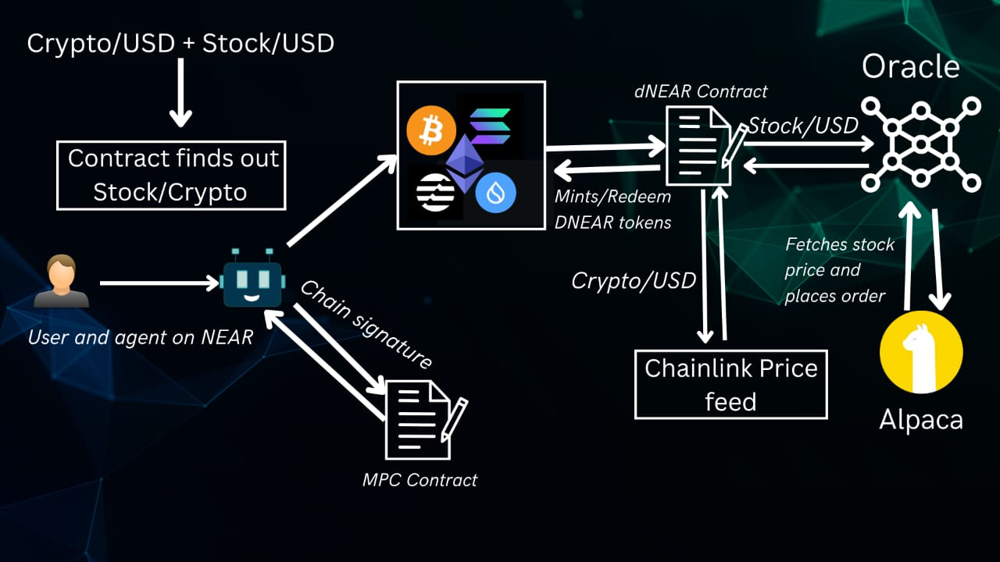

# 🌐 NEAR.AI — Cross Chain Tokenization Powered by AI Agents

> Break asset barriers. Simplify cross-chain access. Let AI handle Web3.

---

## 🧩 The Problem

Web3 promises decentralization, but today's experience is fragmented and difficult:

- **🌍 Border Barriers of Assets**  
  Global users face restrictions in accessing real-world assets due to geographical and regulatory boundaries.

- **🔐 Fragmented Key Management**  
  Managing private keys across multiple chains is confusing, insecure, and a major hurdle for onboarding Web2 users.

- **🧠 Complex UX of Web3 dApps**  
  Users are forced to juggle between wallets, chains, and keys. What if they could simply “ask” in natural language?

---

## ✅ Our Solution

**NEAR.AI** brings together AI Agents, Tokenization, and Cross-Chain Signatures into a seamless Web3 interface:

### 💰 Tokenization of Assets
Real-world assets like stocks are digitized into tokens (e.g., tokenized Apple stock).

### 🔗 NEAR Cross-Chain Signatures
Use your **NEAR wallet** to interact with **Ethereum**, **Solana**, and beyond. One key, many chains — no need to manage multiple wallets.

### 🤖 AI Agents for Web3
Powered by **ElizaOS**, users describe actions in natural language (e.g., _“Mint 1 Apple stock token on Ethereum”_), and the AI agent executes it behind the scenes.

---

## 🛠️ Tech Stack

| Layer         | Tech Used               | Description                                                                 |
|--------------|--------------------------|-----------------------------------------------------------------------------|
| 🤖 AI Agent   | [ElizaOS](https://elizaos.ai/)          | NLP-driven autonomous agent to interpret and act on user queries.           |
| 🔐 Blockchain SDK | [NEAR SDK](https://docs.near.org/)       | Core layer for user authentication and signature management.                |
| 🔀 Cross-Chain | **NEAR Cross-Chain Signatures** | Enables secure interaction with multiple chains from one NEAR wallet.       |
| 🧠 Oracle     | [Chainlink](https://chain.link/)        | Bridges real-world asset data (price, ownership proof) into smart contracts.|
| 💻 Smart Contracts | Solidity                  | Used for writing cross-chain tokenization and mint/redeem logic.            |

---

## ⚙️ System Architecture



---

## 🚀 Example Flow

## 🟢 Mint Flow

1. **User chats with the ElizaOS agent on NEAR**  
   > _"Buy 3 shares of AAPL using 10 ETH"_

2. **Agent sends the mint transaction** using NEAR private key to the **MPC contract** to sign.
   
4. **MPC contract responds with the signature.

5. **Signed transaction is broadcasted** to the `dNEAR` smart contract on **Ethereum**

6. **Oracle**:
   - Fetches real-time **AAPL stock price (USD)**
   - Places an **off-chain order** to buy stock via custom JS

7. **Chainlink Price Feed**:
   - Fetches **ETH/USD** price

8. **Smart Contract Logic**:
   ```solidity
   if (ETH_in_usd >= stock_price_usd * quantity) {
       mint DNEAR token(s);
       update totalHoldings[requester][stock];
       refund excess ETH;
   }


## 🚀 Redeem Flow

1. **User chats with the ElizaOS agent on NEAR**  
   > _"Sell 3 shares of AAPL"_

2. **Agent sends the redeem transaction** using NEAR private key to the **MPC contract** to sign.
   
4. **MPC contract responds with the signature.

5. **Signed transaction is broadcasted** to the `dNEAR` smart contract on **Ethereum**.

6. **Oracle**:
   - Fetches real-time **AAPL stock price (USD)**
   - Places an **off-chain order** to buy stock via custom JS

7. **Chainlink Price Feed**:
   - Fetches **ETH/USD** price

8. **Smart Contract Logic**:
   ```solidity
   if (totalHoldings[requester][stock] >= quantity) {
   burn DNEAR token(s)
   update totalHoldings
   send back  ETH equivalent to stock_price_usd * quantity   }  

## 📂 Folder Structure

```
/foundry/src/dNEAR.sol       -> Solidity contract (dNEAR logic, oracles)
/ai-agent/src                -> ElizaOS agent logic
```

---

## 🌍 Demo

- 📽️ [Demo Video](https://demo-video-link.com)
